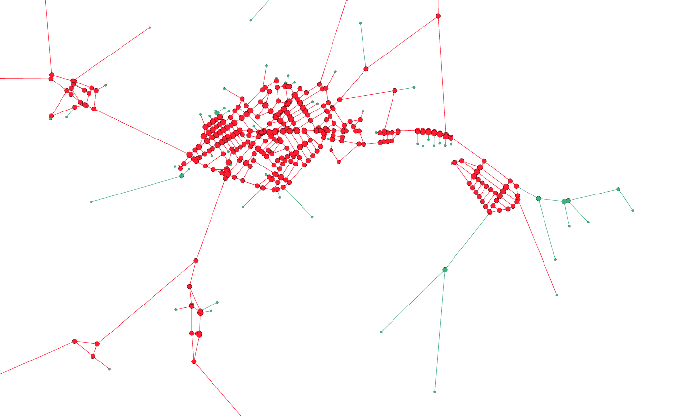
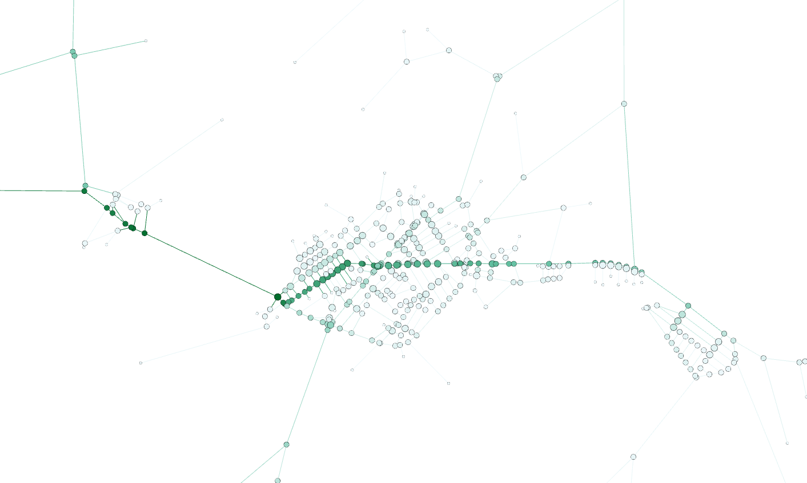
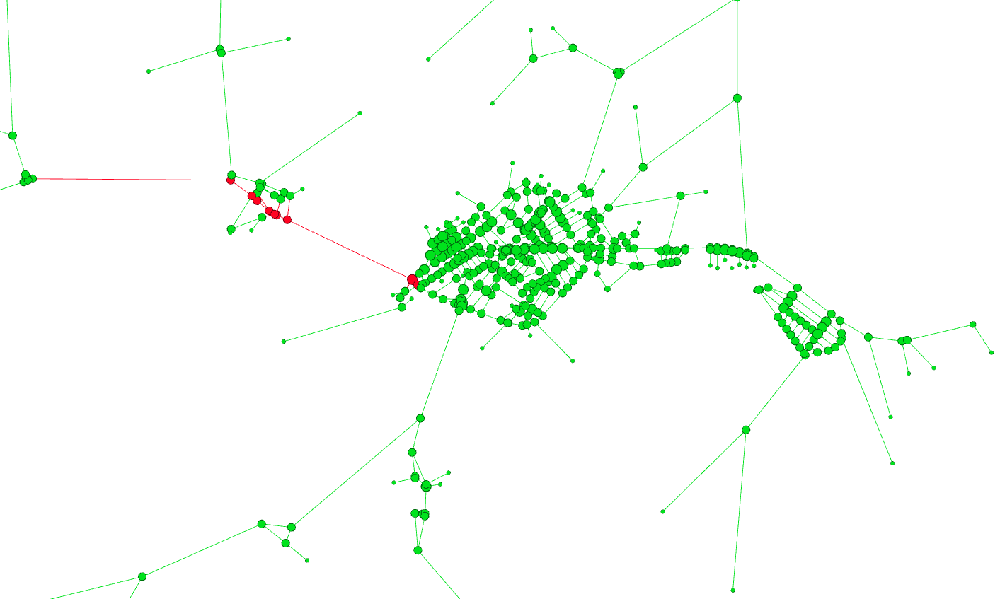
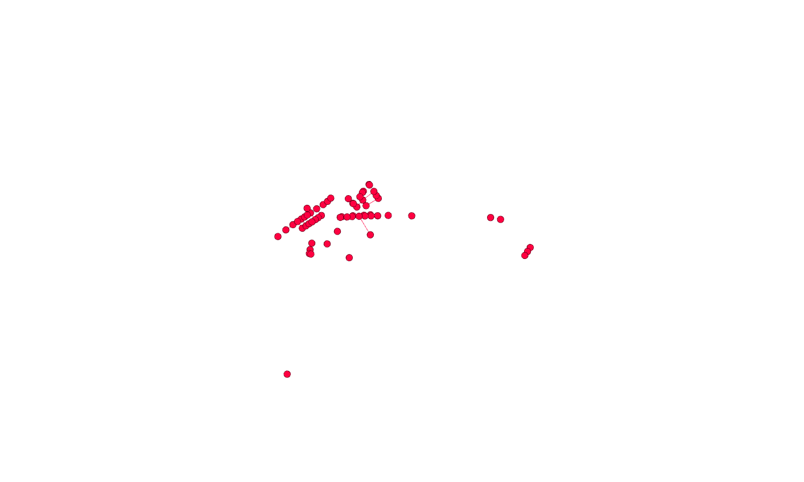
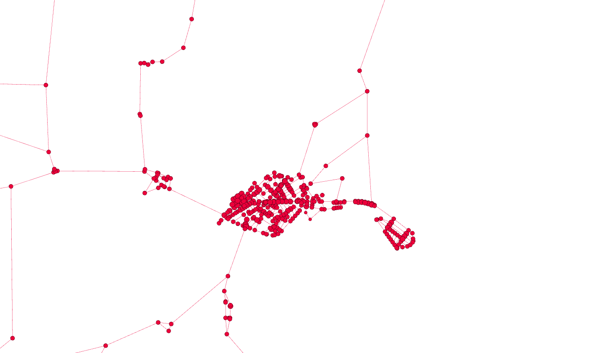
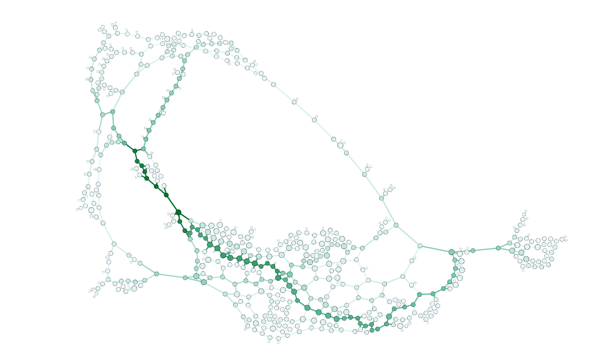
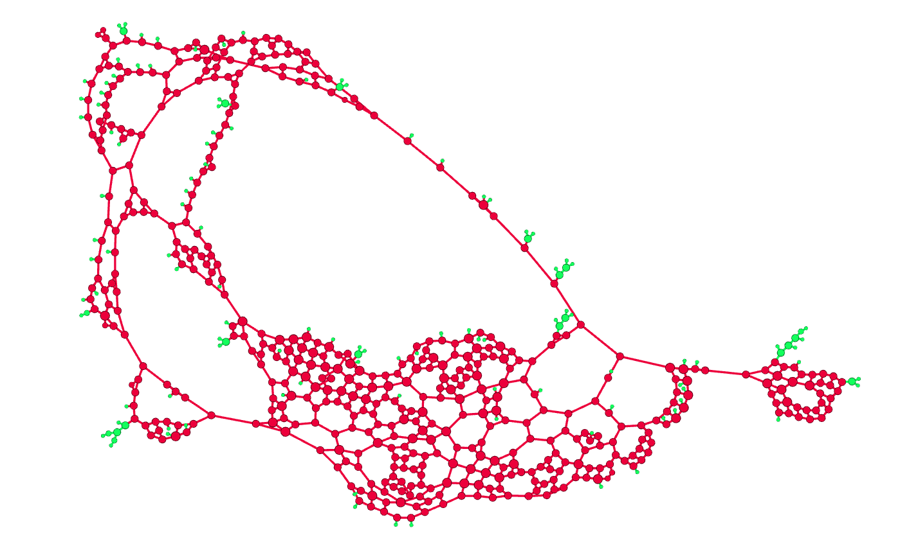

# Análise Estrutural da Rede Viária de Cruzeta/RN

Este projeto analisa a malha viária de **Cruzeta/RN** como um grafo, usando dados do OpenStreetMap extraídos com OSMnx, métricas estruturais calculadas com NetworkX e visualização complementar no Gephi.

A proposta é responder, com base em evidências quantitativas e visuais, quais elementos da rede urbana se comportam como hubs, quais pontos concentram intermediação, como o k-core caracteriza a estrutura da rede e como a leitura geográfica difere da leitura estrutural por layout de força.

## Autores

| Nome | Curso | Matrícula | Perfil |
|---|---|---:|---|
| EDIVELTON RAFAETT SILVA DE ARAÚJO | Engenharia de Computação/CT | 20230094613 | [edivelton](https://github.com/edivelton) |
| FRANCISCO MICARLOS TEIXEIRA PINTO | Engenharia de Computação/CT | 20260000734 | [micarlio](https://github.com/micarlio) |

## Divisão das atividades

- Edivelton e Francisco produziram os códigos juntos.
- Edivelton ficou responsável pelas visualizações no Gephi.
- Francisco Micarlos ficou responsável pelas perguntas analíticas.

## Estrutura do projeto

```text
analise-rede-viaria-cruzeta-rn/
|-- analise_rede_urbana_cruzeta_rn.ipynb
|-- README.md
|-- requirements.txt
|-- entrega_cruzeta_rn.zip
`-- outputs/
    |-- figures/
    |   |-- 01_distribuicao_grau_cdf.png
    |   |-- 02_grau_vs_betweenness.png
    |   `-- 03_distribuicao_core.png
    |-- gephi/
    |   |-- cruzeta_rn_rede_urbana.graphml
    |   `-- figures/
    |       |-- 01_geografico_core_degree.png
    |       |-- 02_geografico_betweenness_degree.png
    |       |-- 03_geografico_top10_betweenness.png
    |       |-- 04_filtro_top10pct_grau.png
    |       |-- 05_filtro_kcore.png
    |       |-- 06_forceatlas_betweenness_degree.png
    |       `-- 07_forceatlas_core_degree.png
    |-- maps/
    |   `-- mapa_interativo_rede_viaria_cruzeta.html
    `-- tables/
        |-- cruzeta_nodes_metrics.csv
        |-- cruzeta_summary.json
        |-- cruzeta_top_hubs_by_degree.csv
        |-- cruzeta_top_betweenness.csv
        |-- cruzeta_top_closeness.csv
        `-- demais tabelas auxiliares
```

## Tecnologias utilizadas

- **Python**: linguagem principal da análise.
- **OSMnx**: extração da rede viária a partir do OpenStreetMap.
- **NetworkX**: cálculo das métricas de grafos.
- **Pandas/Numpy**: organização tabular e estatística dos resultados.
- **Matplotlib/Seaborn**: gráficos quantitativos no notebook.
- **Folium/Leaflet**: mapa HTML interativo com zoom, camadas e popups.
- **Gephi**: visualizações geográfica e estrutural da rede.

## Metodologia

### 1. Coleta da rede viária

A rede foi obtida com `network_type="drive"`, de modo que o grafo represente ruas e rodovias destinadas ao tráfego de veículos.

```python
PLACE = "Cruzeta, Rio Grande do Norte, Brazil"
NETWORK_TYPE = "drive"

G_drive = ox.graph_from_place(
    PLACE,
    network_type=NETWORK_TYPE,
    simplify=True,
)
```

No grafo original do OSMnx, cada nó representa uma interseção ou um ponto relevante da geometria viária, e cada aresta representa um segmento de via. Os atributos `x` e `y` correspondem à longitude e à latitude, sendo fundamentais para o Geo Layout no Gephi.

### 2. Conversão para grafo simples não direcionado

O OSMnx retorna um `MultiDiGraph`, que pode conter direção e arestas paralelas. Para as métricas estruturais do trabalho, o grafo foi convertido para uma versão simples e não direcionada:

```python
simple = nx.Graph()

# Arestas paralelas são colapsadas mantendo o menor comprimento.
if simple.has_edge(u, v):
    if length < simple[u][v]["length"]:
        simple[u][v].update(attrs)
else:
    simple.add_edge(u, v, **attrs)
```

Essa decisão evita duplicidade de arestas e permite o cálculo direto de grau, core number, closeness e betweenness. O comprimento das vias (`length`) foi preservado para ponderar métricas baseadas em distância.

### 3. Métricas calculadas

Foram calculadas as métricas exigidas no enunciado:

```python
degree = dict(G.degree())
degree_centrality = nx.degree_centrality(G)
closeness = nx.closeness_centrality(G, distance="length")
betweenness = nx.betweenness_centrality(G, normalized=True, weight="length")
core_number = nx.core_number(G)
eigenvector = nx.eigenvector_centrality(G, max_iter=2000, tol=1e-6)
```

A betweenness e a closeness foram ponderadas pelo comprimento das vias em metros. Isso torna a análise mais próxima do deslocamento real na rede urbana, em vez de considerar apenas a quantidade de arestas percorridas.

## Resumo da rede

| Indicador | Valor |
|---|---:|
| Região | Cruzeta/RN, Brasil |
| Consulta OSMnx | `Cruzeta, Rio Grande do Norte, Brazil` |
| Tipo de rede | `drive` |
| Nós | 607 |
| Arestas | 840 |
| Grafo conectado | Sim |
| Comprimento total aproximado | 211.44 km |
| Densidade | 0.004567 |
| Grau médio | 2.768 |
| Grau máximo | 4 |
| Maior core number | 2 |
| k escolhido | 2 |
| Nós no k-core escolhido | 480 (79.08%) |
| Diâmetro não ponderado | 43 |
| Raio não ponderado | 29 |

A rede analisada possui **607 nós** e **840 arestas**, com grau médio de **2.77**. O grau máximo observado foi **4**, valor típico de redes viárias, nas quais cruzamentos raramente possuem muitas conexões diretas.

## Distribuição de grau

| Grau | Nós | Percentual |
| --- | ---: | ---: |
| 1 | 107 | 17.63% |
| 2 | 11 | 1.81% |
| 3 | 405 | 66.72% |
| 4 | 84 | 13.84% |


A distribuição mostra que a maior parte dos nós possui grau 3. Isso indica uma rede predominantemente formada por interseções simples, com poucos nós de grau 4 e uma parcela relevante de nós de grau 1, que representam extremidades, ruas sem continuidade ou acessos periféricos.

A linha vermelha representa a **CDF** (*Cumulative Distribution Function*), isto é, a probabilidade acumulada de um nó ter grau menor ou igual a determinado valor. Por isso, o valor em grau 2 inclui os nós de grau 1 e de grau 2.

## Distribuição por core number

| Core number | Nós | Percentual |
| --- | ---: | ---: |
| 1 | 127 | 20.92% |
| 2 | 480 | 79.08% |


O maior core number encontrado foi **2**. O k-core escolhido, portanto, foi **k = 2**, contendo **480 nós**, aproximadamente **79.08%** da rede.

Esse resultado indica que o k-core principal retira nós periféricos ou pouco conectados, mas ainda preserva uma parcela ampla da rede. Assim, o k-core ajuda a separar a estrutura persistente da malha, mas não deve ser usado isoladamente para identificar os principais hubs.

## Resumo estatístico das métricas

| Métrica | Média | Desvio | Mínimo | Mediana | Máximo |
| --- | ---: | ---: | ---: | ---: | ---: |
| degree | 2.767710 | 0.899438 | 1.000000 | 3.000000 | 4.000000 |
| degree_centrality | 0.004567 | 0.001484 | 0.001650 | 0.004950 | 0.006601 |
| betweenness | 0.044947 | 0.075399 | 0.000000 | 0.015122 | 0.387677 |
| closeness | 0.000232 | 0.000078 | 0.000066 | 0.000259 | 0.000321 |
| core_number | 1.790774 | 0.407091 | 1.000000 | 2.000000 | 2.000000 |

O desvio padrão da betweenness é maior que sua média, indicando concentração dessa métrica em poucos nós. Isso sugere que alguns pontos funcionam como passagens estruturais importantes, mesmo quando não são os nós de maior grau.

## Hubs por grau

A tabela abaixo lista os 10 maiores hubs por grau. Como há muitos empates em redes viárias, os empates foram ordenados por betweenness.

| Nó | Grau | Betweenness | Closeness | Core | Vias incidentes |
| --- | ---: | ---: | ---: | ---: | --- |
| 2098173324 | 4 | 0.387677 | 0.000311 | 2 | Avenida Carmelita Monteiro da Silva / RN-288 / secondary / Rua Cipriano Lopes Galvão / residential / residential |
| 2098133818 | 4 | 0.285247 | 0.000320 | 2 | Avenida Doutor Sílvio Bezerra de Melo / secondary / Rua Emílio Vale / residential |
| 2098918029 | 4 | 0.277970 | 0.000320 | 2 | Praça Celso Azevedo / residential / Rua Félix Pereira de Araújo / secondary / Rua Sebastião Araújo / residential |
| 2098943368 | 4 | 0.267354 | 0.000320 | 2 | Avenida Doutor Sílvio Bezerra de Melo; Rua Félix Pereira de Araújo / secondary / Praça Celso Azevedo / residential / Rua Félix Pereira de Araújo / secondary / Rua João Lopes de Araújo / residential |
| 2098144101 | 4 | 0.266808 | 0.000320 | 2 | Avenida Doutor Sílvio Bezerra de Melo / secondary / Avenida Doutor Sílvio Bezerra de Melo; Rua Félix Pereira de Araújo / secondary / Rua Miguel Laurentino / residential / residential |
| 2098144124 | 4 | 0.266170 | 0.000318 | 2 | Rua Félix Pereira de Araújo / secondary / Rua João Gomes / residential / Rua Raimundo Hermes Dantas / residential |
| 7375819476 | 4 | 0.265996 | 0.000321 | 2 | Avenida Doutor Sílvio Bezerra de Melo / secondary / Rua João XXIII / tertiary |
| 2098144097 | 4 | 0.265843 | 0.000320 | 2 | Avenida Doutor Sílvio Bezerra de Melo / secondary / Rua Geraldo Lopes de Araújo / residential |
| 2098144128 | 4 | 0.264206 | 0.000319 | 2 | Rua Félix Pereira de Araújo / secondary / Rua Leôncio Pires Galvão / residential |
| 7375826292 | 4 | 0.237373 | 0.000319 | 2 | Avenida Doutor Sílvio Bezerra de Melo / secondary / residential |

## Nós com maior betweenness

A betweenness identifica nós que aparecem com frequência nos menores caminhos da rede. Esses nós podem ser críticos para mobilidade porque conectam regiões distintas.

| Nó | Grau | Betweenness | Closeness | Core | Vias incidentes |
| --- | ---: | ---: | ---: | ---: | --- |
| 2098173324 | 4 | 0.387677 | 0.000311 | 2 | Avenida Carmelita Monteiro da Silva / RN-288 / secondary / Rua Cipriano Lopes Galvão / residential / residential |
| 2340784260 | 3 | 0.380520 | 0.000280 | 2 | Avenida Carmelita Monteiro da Silva / RN-288 / secondary / RN-288 / secondary / residential |
| 314979940 | 3 | 0.372648 | 0.000277 | 2 | RN-288 / secondary / Rua Maria Izaura de Araújo / residential |
| 7374755393 | 3 | 0.368791 | 0.000277 | 2 | RN-288 / secondary / residential |
| 2340784276 | 3 | 0.358236 | 0.000275 | 2 | RN-288 / secondary / residential |
| 2340784271 | 3 | 0.357767 | 0.000265 | 2 | RN-288 / secondary / unclassified |
| 7375628953 | 3 | 0.344227 | 0.000271 | 2 | RN-288 / secondary / residential |
| 2340028998 | 3 | 0.343774 | 0.000272 | 2 | RN-288 / secondary / Rua Cipriana Bezerra de Medeiros / residential |
| 2098144099 | 3 | 0.335957 | 0.000313 | 2 | Avenida Carmelita Monteiro da Silva / RN-288 / secondary / Rua Félix Pereira de Araújo / secondary |
| 2340078036 | 3 | 0.334943 | 0.000312 | 2 | Avenida Carmelita Monteiro da Silva / RN-288 / secondary / Rua Francisco Raimundo de Araújo / residential |

Observa-se que vários nós de maior betweenness estão associados à **RN-288** e à **Avenida Carmelita Monteiro da Silva**, indicando um eixo de circulação importante na estrutura da rede. Essa leitura também aparece nas visualizações do Gephi e no mapa interativo, onde esses nós podem ser localizados no território municipal.

## Comparação: grau x betweenness


O gráfico compara conectividade local (`degree`) com intermediação global (`betweenness`). A cor representa o `core_number`, e os círculos destacados indicam os 10 maiores valores de betweenness.

Apenas **1** nó do top 10 por betweenness também aparece no top 10% por grau. Isso mostra que grau e betweenness capturam dimensões diferentes da importância estrutural.

| Nó | Grau | Betweenness | Core | Top grau | Top betweenness | Vias incidentes |
| --- | ---: | ---: | ---: | --- | --- | --- |
| 2098173324 | 4 | 0.387677 | 2 | True | True | Avenida Carmelita Monteiro da Silva / RN-288 / secondary / Rua Cipriano Lopes Galvão / residential / residential |
| 2340784260 | 3 | 0.380520 | 2 | False | True | Avenida Carmelita Monteiro da Silva / RN-288 / secondary / RN-288 / secondary / residential |
| 314979940 | 3 | 0.372648 | 2 | False | True | RN-288 / secondary / Rua Maria Izaura de Araújo / residential |
| 7374755393 | 3 | 0.368791 | 2 | False | True | RN-288 / secondary / residential |
| 2340784276 | 3 | 0.358236 | 2 | False | True | RN-288 / secondary / residential |
| 2340784271 | 3 | 0.357767 | 2 | False | True | RN-288 / secondary / unclassified |
| 7375628953 | 3 | 0.344227 | 2 | False | True | RN-288 / secondary / residential |
| 2340028998 | 3 | 0.343774 | 2 | False | True | RN-288 / secondary / Rua Cipriana Bezerra de Medeiros / residential |
| 2098144099 | 3 | 0.335957 | 2 | False | True | Avenida Carmelita Monteiro da Silva / RN-288 / secondary / Rua Félix Pereira de Araújo / secondary |
| 2340078036 | 3 | 0.334943 | 2 | False | True | Avenida Carmelita Monteiro da Silva / RN-288 / secondary / Rua Francisco Raimundo de Araújo / residential |
| 2098133818 | 4 | 0.285247 | 2 | True | False | Avenida Doutor Sílvio Bezerra de Melo / secondary / Rua Emílio Vale / residential |
| 2098918029 | 4 | 0.277970 | 2 | True | False | Praça Celso Azevedo / residential / Rua Félix Pereira de Araújo / secondary / Rua Sebastião Araújo / residential |

## Nós com maior closeness

A closeness centrality mede quão próximo um nó está dos demais, considerando as distâncias ponderadas pelo comprimento das vias. Valores maiores indicam nós com menor distância média até o restante da rede.

| Nó | Grau | Betweenness | Closeness | Core | Vias incidentes |
| --- | ---: | ---: | ---: | ---: | --- |
| 7375819476 | 4 | 0.265996 | 0.000321 | 2 | Avenida Doutor Sílvio Bezerra de Melo / secondary / Rua João XXIII / tertiary |
| 7375826296 | 3 | 0.144718 | 0.000321 | 2 | Avenida Doutor Sílvio Bezerra de Melo / secondary / Rua João XXIII / tertiary |
| 2098144081 | 3 | 0.278941 | 0.000321 | 2 | Avenida Doutor Sílvio Bezerra de Melo / secondary |
| 7375819471 | 3 | 0.220402 | 0.000321 | 2 | Avenida Doutor Sílvio Bezerra de Melo / secondary / Rua Manoel Martiniano de Medeiros / tertiary |
| 7375819470 | 4 | 0.152268 | 0.000321 | 2 | Avenida Doutor Sílvio Bezerra de Melo / secondary / Rua Manoel Martiniano de Medeiros / tertiary |
| 2098144093 | 3 | 0.279639 | 0.000321 | 2 | Avenida Doutor Sílvio Bezerra de Melo / secondary / residential |
| 2098136084 | 3 | 0.092966 | 0.000320 | 2 | Rua João XXIII / tertiary / residential |
| 2098133818 | 4 | 0.285247 | 0.000320 | 2 | Avenida Doutor Sílvio Bezerra de Melo / secondary / Rua Emílio Vale / residential |
| 2340015648 | 3 | 0.091307 | 0.000320 | 2 | Rua Antônio Apolinário / residential / Rua João XXIII / tertiary |
| 2098144097 | 4 | 0.265843 | 0.000320 | 2 | Avenida Doutor Sílvio Bezerra de Melo / secondary / Rua Geraldo Lopes de Araújo / residential |

## Mapa interativo

O notebook principal gera um mapa HTML interativo com zoom, deslocamento, controle de camadas e popups por nó. Esse recurso complementa as imagens estáticas, porque permite explorar o município inteiro sem perder o contexto espacial da rede.

[Abrir mapa interativo da rede viária de Cruzeta/RN](https://edivelton.github.io/datastructure/projects/analise-rede-viaria-cruzeta-rn/outputs/maps/mapa_interativo_rede_viaria_cruzeta.html)

Arquivo versionado no projeto:

```text
outputs/maps/mapa_interativo_rede_viaria_cruzeta.html
```

Camadas disponíveis no mapa:

- rede viária;
- todos os nós;
- k-core escolhido;
- top 10% dos nós por grau;
- top 10 nós por betweenness.

O mapa foi ajustado para abrir com as camadas mais úteis já marcadas: rede viária, todos os nós, top 10% por grau e top 10 por betweenness. A camada de k-core permanece disponível, mas desligada por padrão, porque o k-core principal contém 480 nós, ou seja, 79.08% da rede, e pode deixar a leitura inicial visualmente carregada.

## Visualizações geográficas no Gephi

As imagens abaixo foram produzidas no Gephi a partir do arquivo `outputs/gephi/cruzeta_rn_rede_urbana.graphml`. Como o recorte usado é o município de Cruzeta/RN, e não apenas a sede urbana, a rede aparece muito espalhada por causa das conexões rurais e dos sítios. Por isso, alguns prints foram recortados para destacar o que precisa ser interpretado em cada pergunta. Para navegar pelo município inteiro sem perder contexto, use o mapa HTML interativo como complemento.

### 1. Geo Layout: core number e grau



Esta visualização preserva a posição geográfica dos nós. As cores representam o `core_number` e o tamanho dos nós representa o `degree`. Ela mostra que a parte mais densa da rede se concentra na sede urbana, enquanto as ligações periféricas e rurais se espalham pelo município. Os cortes na imagem são consequência direta da extensão territorial do município: exibir todo o grafo em uma única imagem reduziria demais os detalhes da área urbana.

Para explorar a mesma leitura com zoom: [abra o mapa interativo](https://edivelton.github.io/datastructure/projects/analise-rede-viaria-cruzeta-rn/outputs/maps/mapa_interativo_rede_viaria_cruzeta.html) e deixe marcadas as camadas **Rede viária**, **Todos os nós**, **K-core escolhido** e **Top 10% por grau**.

### 2. Geo Layout: betweenness e grau



Nesta imagem, o tamanho dos nós continua associado ao grau, mas a coloração evidencia a betweenness. Os pontos mais escuros aparecem em corredores de passagem, especialmente no eixo associado à RN-288 e à Avenida Carmelita Monteiro da Silva. Isso ajuda a mostrar que intermediação não é a mesma coisa que quantidade de conexões locais.

Para explorar sem o recorte da imagem: [abra o mapa interativo](https://edivelton.github.io/datastructure/projects/analise-rede-viaria-cruzeta-rn/outputs/maps/mapa_interativo_rede_viaria_cruzeta.html) e mantenha marcadas as camadas **Rede viária**, **Todos os nós**, **Top 10% por grau** e **Top 10 betweenness**.

### 3. Geo Layout: top 10 por betweenness



Esta visualização destaca os 10 nós com maior betweenness. A concentração desses pontos em um trecho específico da rede indica que parte relevante dos menores caminhos passa por esse corredor. O mapa interativo permite aproximar esse mesmo trecho e clicar nos nós para ver grau, betweenness, closeness, core number e vias incidentes.

Para conferir os nós destacados diretamente no território: [abra o mapa interativo](https://edivelton.github.io/datastructure/projects/analise-rede-viaria-cruzeta-rn/outputs/maps/mapa_interativo_rede_viaria_cruzeta.html) e deixe marcada a camada **Top 10 betweenness**. Se quiser uma leitura mais limpa, desmarque **Todos os nós**.

### 4. Filtro: top 10% por grau



Este filtro mostra os nós classificados no top 10% por grau. Como o grau máximo da rede é 4, a seleção fica concentrada em cruzamentos de maior conectividade local. A imagem deixa claro que esses nós aparecem sobretudo na malha urbana mais densa, mas não coincidem integralmente com os nós de maior betweenness.

Para navegar por esses pontos no mapa: [abra o HTML interativo](https://edivelton.github.io/datastructure/projects/analise-rede-viaria-cruzeta-rn/outputs/maps/mapa_interativo_rede_viaria_cruzeta.html) e deixe marcada a camada **Top 10% por grau**.

### 5. Filtro: k-core escolhido



O k-core escolhido foi `k = 2`, pois o maior core number encontrado na rede foi 2. O filtro mantém 480 dos 607 nós, aproximadamente 79.08% da rede. Isso mostra que o k-core remove extremidades e pontos mais periféricos, mas ainda preserva grande parte da estrutura municipal; por esse motivo, ele é útil para separar a rede persistente, mas não é seletivo o suficiente para identificar sozinho os hubs mais importantes.

Para visualizar esse filtro com zoom: [abra o mapa interativo](https://edivelton.github.io/datastructure/projects/analise-rede-viaria-cruzeta-rn/outputs/maps/mapa_interativo_rede_viaria_cruzeta.html), marque **K-core escolhido** e, se quiser isolar melhor o núcleo, desmarque **Todos os nós**.

### 6. ForceAtlas2: betweenness e grau



O ForceAtlas2 abandona a posição geográfica real e reorganiza a rede pela conectividade. Nessa leitura estrutural, os nós com maior betweenness formam uma sequência de passagem entre regiões do grafo, funcionando como pontos de articulação. A imagem reforça que a importância global de um nó depende de sua posição nos caminhos da rede, não apenas do número de ruas conectadas diretamente a ele.

Essa visualização não tem equivalente direto no HTML, porque o HTML preserva a posição geográfica real. Ela deve ser lida como uma visão estrutural complementar ao mapa.

### 7. ForceAtlas2: core number e grau



Nesta visualização estrutural, a maior parte da rede permanece no core 2, enquanto os nós de core 1 aparecem como extremidades e ramos periféricos. Isso confirma a leitura do k-core: a rede possui um núcleo amplo e muitas pontas, padrão esperado em uma malha viária municipal que mistura área urbana e conexões rurais.

Assim como a visualização anterior, esta imagem é própria do ForceAtlas2 no Gephi. O HTML complementa a análise quando o objetivo é localizar esses nós geograficamente.

## Arquivo para Gephi

O arquivo abaixo contém o grafo enriquecido com as métricas calculadas:

```text
outputs/gephi/cruzeta_rn_rede_urbana.graphml
```

Atributos importantes presentes nos nós:

| Atributo | Uso no Gephi |
|---|---|
| `x` | Longitude para Geo Layout |
| `y` | Latitude para Geo Layout |
| `degree` | Tamanho dos nós |
| `betweenness` | Destaque de pontos de intermediação |
| `closeness` | Análise de proximidade na rede |
| `core_number` | Cor dos nós e filtro por k-core |
| `top_10pct_degree` | Filtro do top 10% por grau |
| `top_10_betweenness` | Destaque dos 10 maiores nós por betweenness |
| `selected_k_core` | Filtro do k-core escolhido |

## Visualizações no Gephi

O GraphML foi preparado para permitir as visualizações e filtros exigidos no Gephi. As imagens incorporadas ao README foram geradas com o seguinte fluxo:

1. Importar `outputs/gephi/cruzeta_rn_rede_urbana.graphml`.
2. Aplicar **Geo Layout** usando:
   - longitude = `x`
   - latitude = `y`
3. Codificar visualmente:
   - tamanho do nó proporcional a `degree`;
   - cor do nó por `core_number`;
   - destaque para `top_10_betweenness == 1`.
4. Exportar a visualização geográfica base.
5. Exportar a visualização geográfica com destaque dos nós de maior betweenness.
6. Exportar os filtros `top_10pct_degree == 1` e `selected_k_core == 1`.
7. Criar uma visualização estrutural com **ForceAtlas2** para comparar a forma geográfica real com a organização estrutural do grafo.
8. Exportar o ForceAtlas2 com destaque por betweenness/grau e por core number/grau.
9. Aplicar os filtros obrigatórios:
   - `top_10pct_degree == 1`;
   - `selected_k_core == 1` ou `core_number >= 2`.

## Respostas às questões do professor

### 1. Os nós com maior grau coincidem com os nós de maior betweenness?

Não completamente. A coincidência é pequena: apenas **1 nó** aparece simultaneamente entre os 10 maiores por betweenness e no top 10% por grau. Esse nó é `2098173324`, com grau 4 e betweenness de aproximadamente **0.387677**.

Isso mostra que o grau mede conectividade local, enquanto a betweenness mede importância nos caminhos globais da rede. Em Cruzeta/RN, vários nós com grau 3 aparecem entre os maiores valores de betweenness, o que indica que eles não são os cruzamentos com mais conexões diretas, mas funcionam como pontos de passagem relevantes.

Evidências usadas:

- tabela `cruzeta_hubs_vs_betweenness.csv`;
- gráfico **Grau local x intermediação**;
- visualização **Geo Layout: betweenness e grau**;
- visualização **ForceAtlas2: betweenness e grau**.

### 2. O núcleo identificado pelo k-core coincide com os principais hubs?

Em parte. Os principais hubs por grau e os nós de maior betweenness aparecem com `core_number = 2`, portanto pertencem ao núcleo principal da rede. Porém, o k-core escolhido também contém **480 dos 607 nós**, aproximadamente **79.08%** da rede. Isso significa que o k-core é amplo.

A interpretação correta é: o k-core ajuda a remover extremidades e ramos periféricos, mas não identifica sozinho os hubs mais importantes. Para encontrar os pontos realmente estratégicos, é necessário combinar k-core com grau e betweenness.

Evidências usadas:

- tabela `cruzeta_core_distribution.csv`;
- imagem **Filtro: k-core escolhido**;
- imagem **ForceAtlas2: core number e grau**;
- colunas `core_number`, `degree` e `betweenness` nas tabelas de ranking.

### 3. O que a betweenness revela que o grau não revela?

A betweenness revela pontos de intermediação: nós que aparecem com frequência nos menores caminhos entre diferentes partes da rede. O grau não captura isso, porque olha apenas para quantas conexões diretas cada nó possui.

Nos resultados, vários nós de grau 3 aparecem no top 10 por betweenness. Muitos deles estão associados à **RN-288** e à **Avenida Carmelita Monteiro da Silva**, indicando que esse eixo funciona como corredor de passagem importante. Assim, um nó pode não ter grau máximo e ainda ser crítico para a circulação.

Evidências usadas:

- tabela `cruzeta_top_betweenness.csv`;
- imagem **Geo Layout: top 10 por betweenness**;
- imagem **ForceAtlas2: betweenness e grau**;
- popups do mapa HTML, que mostram betweenness, grau e vias incidentes de cada nó.

### 4. O que muda entre a posição geográfica real e o layout estrutural?

Na posição geográfica real, a rede mostra a forma espacial do município: a sede urbana aparece como a parte mais densa, enquanto as conexões rurais e periféricas se espalham pelo território. Essa leitura é importante para entender onde os nós estão fisicamente.

No ForceAtlas2, a posição geográfica deixa de ser preservada. O layout reorganiza a rede pela conectividade, aproximando regiões estruturalmente relacionadas e evidenciando corredores, ramos periféricos e pontos de articulação. Por isso, a visualização estrutural é melhor para entender a função dos nós no grafo, enquanto a visualização geográfica é melhor para localizar esses nós no espaço urbano e municipal.

Evidências usadas:

- imagens **Geo Layout: core number e grau** e **Geo Layout: betweenness e grau**;
- imagens **ForceAtlas2: betweenness e grau** e **ForceAtlas2: core number e grau**;
- mapa HTML interativo para navegação geográfica com zoom.

### 5. Existem regiões críticas para mobilidade urbana na área analisada?

Sim. Os dados indicam pontos críticos principalmente no eixo associado à **RN-288** e à **Avenida Carmelita Monteiro da Silva**. Essa conclusão aparece porque os maiores valores de betweenness se concentram em nós ligados a essas vias.

Esses pontos são críticos porque funcionam como passagens entre partes da rede. Em uma intervenção, bloqueio ou mudança de fluxo nesses trechos, a conectividade entre regiões pode ser mais afetada do que em ruas com baixo valor de betweenness.

Evidências usadas:

- tabela `cruzeta_top_betweenness.csv`;
- imagem **Geo Layout: top 10 por betweenness**;
- imagem **Geo Layout: betweenness e grau**;
- mapa HTML para conferir a posição dos nós e as vias incidentes.

### 6. A rede parece homogênea ou apresenta concentração estrutural?

A rede não é completamente homogênea. Pela distribuição de grau, **405 nós** possuem grau 3, o que representa **66.72%** da rede. Isso sugere uma conectividade local relativamente padronizada, típica de malhas viárias com muitos cruzamentos simples.

Por outro lado, a betweenness é concentrada: a média é aproximadamente **0.044947**, mas o valor máximo chega a **0.387677**. Além disso, o desvio padrão da betweenness (**0.075399**) é maior que a média, sinal de desigualdade na distribuição dessa métrica. Portanto, a rede parece localmente regular, mas estruturalmente concentrada em poucos corredores de passagem.

Evidências usadas:

- gráfico **Distribuição de grau e CDF**;
- tabela `cruzeta_degree_distribution.csv`;
- tabela `cruzeta_metric_summary.csv`;
- imagem **ForceAtlas2: betweenness e grau**.

### 7. Os resultados fazem sentido considerando o conhecimento urbano da região escolhida?

Sim, os resultados fazem sentido para uma análise municipal de Cruzeta/RN. A rede extraída pelo OSMnx cobre o município inteiro, não apenas a área urbana compacta. Por isso, aparecem trechos longos e dispersos relacionados a acessos rurais, sítios e conexões externas. Essa característica explica por que algumas imagens precisam de cortes: uma imagem única do município inteiro reduziria a legibilidade dos detalhes.

A concentração de betweenness em trechos associados à RN-288 é coerente com a função de uma via de ligação. Já a concentração de nós de grau mais alto na malha urbana também é coerente, pois a sede municipal tende a reunir mais cruzamentos e conexões locais. Para preservar o contexto completo sem perder legibilidade, o README oferece o mapa HTML interativo, que permite navegar, aproximar e ligar/desligar camadas conforme a pergunta analisada.

Evidências usadas:

- imagens geográficas do Gephi;
- mapa HTML interativo;
- tabelas de betweenness, grau e k-core;
- arquivo GraphML usado no Gephi.

## Como reproduzir

1. Abrir o notebook `analise_rede_urbana_cruzeta_rn.ipynb` no Google Colab.
2. Executar as células em ordem.
3. Ao final, verificar os arquivos em:
   - `outputs/figures/`
   - `outputs/tables/`
   - `outputs/gephi/`
   - `outputs/maps/`
4. Abrir `outputs/maps/mapa_interativo_rede_viaria_cruzeta.html` para explorar o mapa com zoom.
5. Importar o GraphML no Gephi para reproduzir as visualizações apresentadas no README.

## Vídeo da apresentação

- [Loom](https://www.loom.com/share/72120488ccc44b49853c22e30f70d39c)
- [YouTube](https://youtu.be/Toi1VuF8nSY)
