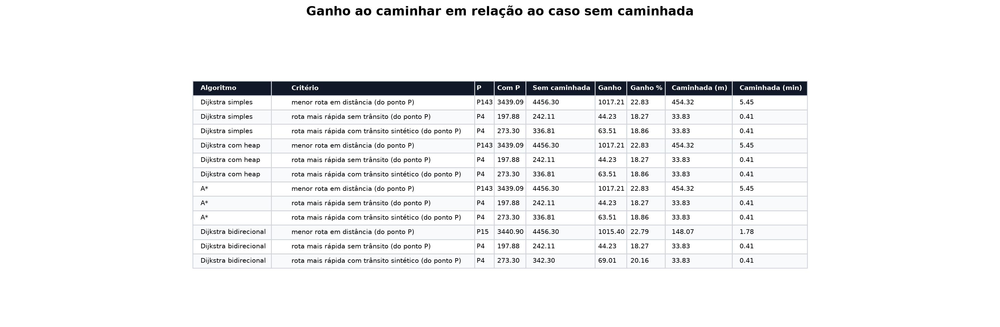
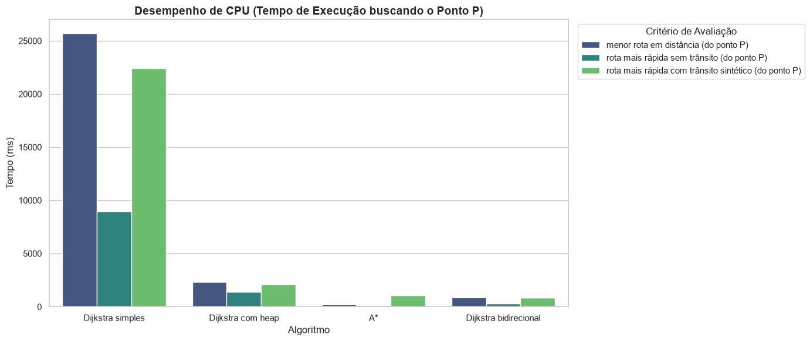
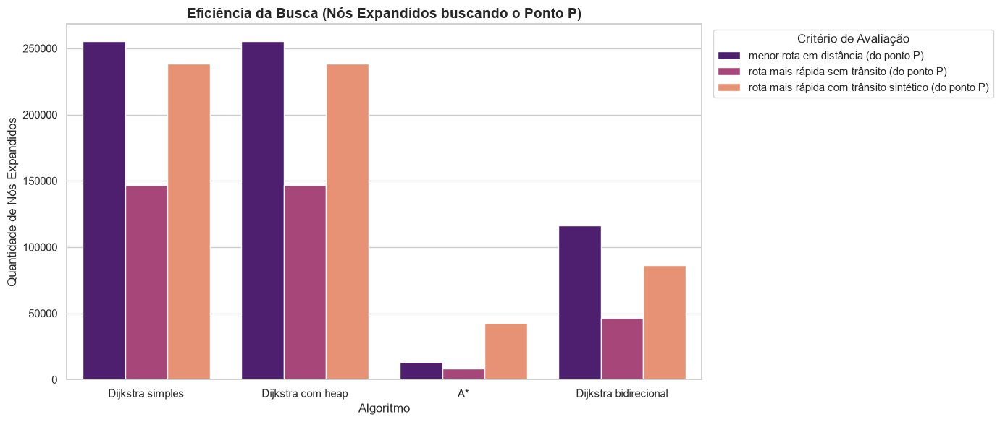
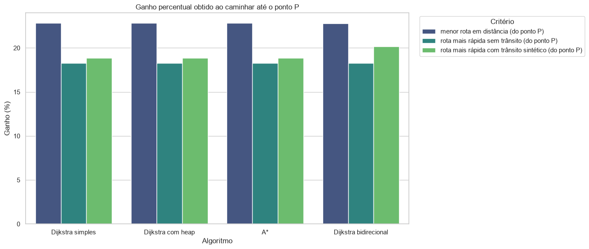
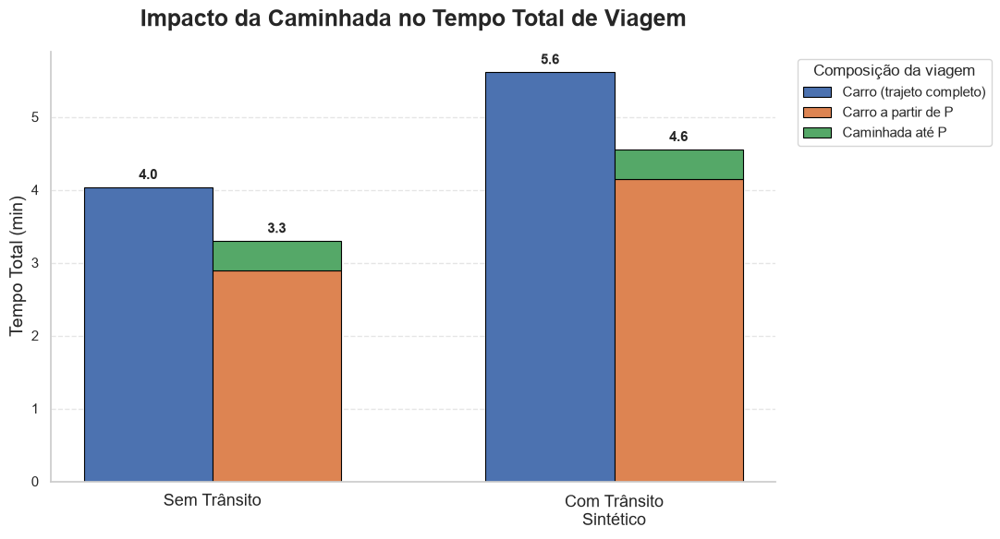
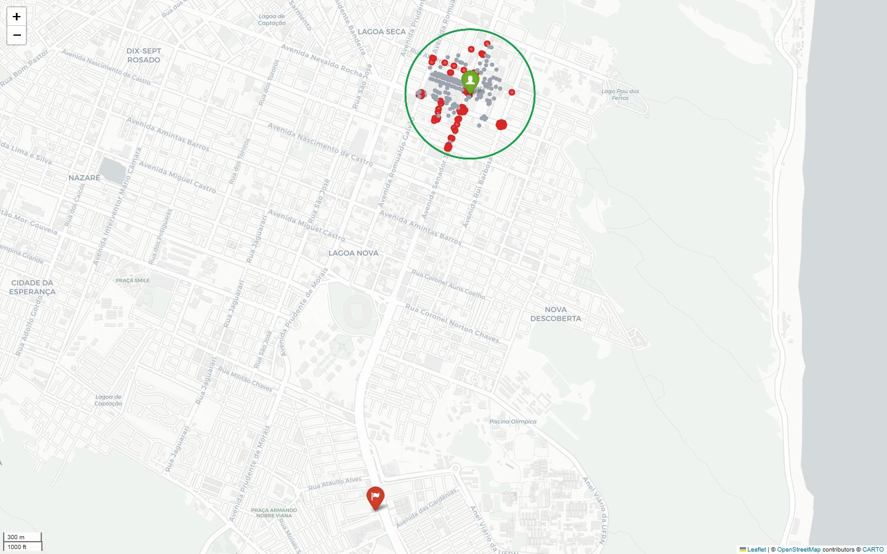
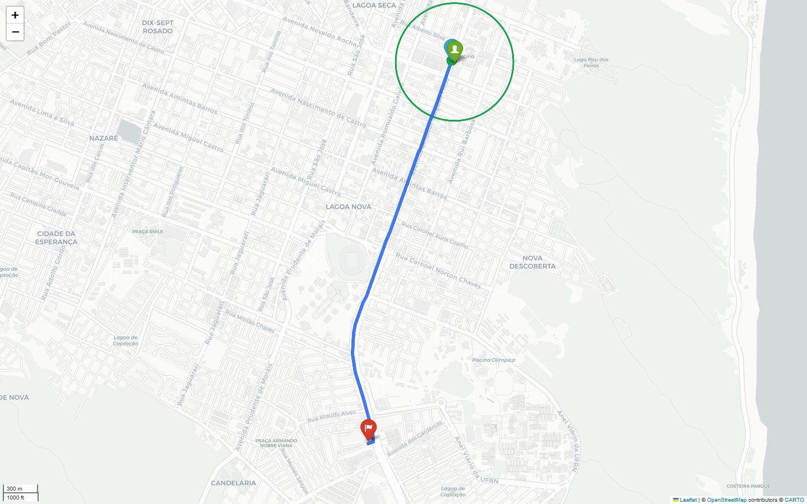
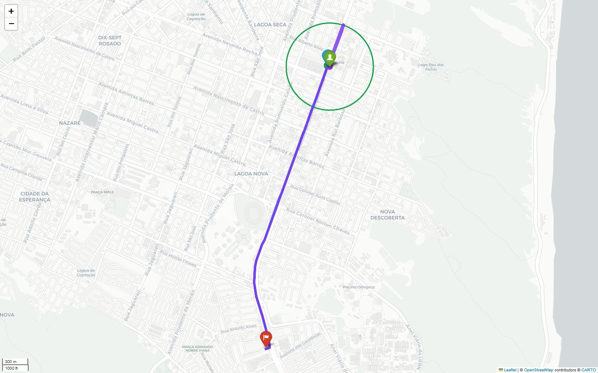
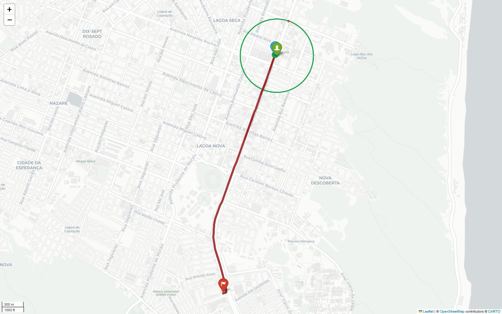
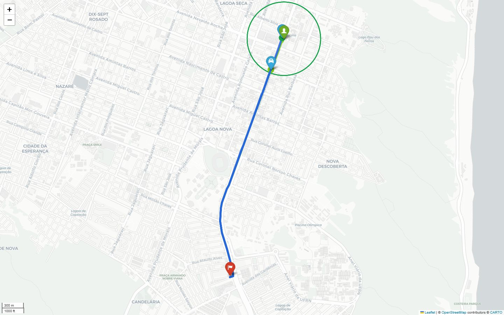

# RideSmart AED2


[Abrir no Google Colab](https://colab.research.google.com/github/edivelton/datastructure/blob/main/projects/ridesmart-aed2/RideSmart_AED2.ipynb)

## Visão Geral

O **RideSmart AED2** é um estudo de modelagem em grafos para avaliar se permitir que um passageiro caminhe até um ponto de embarque alternativo pode melhorar uma viagem urbana.

A proposta foi desenvolvida para o contexto da disciplina de AED2, com foco em:

- representar um problema urbano real como grafo;
- comparar algoritmos clássicos de caminho mínimo;
- avaliar diferentes pesos nas arestas;
- visualizar rotas reais em mapa interativo;
- medir o ganho de permitir caminhada antes do embarque.

O problema considera quatro elementos principais:

| Elemento | Significado |
|---|---|
| **A** | ponto inicial do passageiro |
| **B** | destino final |
| **X** | raio máximo de caminhada permitido |
| **P** | ponto de embarque escolhido dentro do raio **X** |

A viagem é modelada em dois trechos:

```text
A -> P: caminhada no grafo de pedestres
P -> B: carro no grafo de direção
```

Também é calculado o caso sem caminhada:

```text
A = P
```

Esse caso serve como linha de comparação. Assim, o notebook consegue responder se caminhar até outro ponto realmente melhora a rota ou se embarcar diretamente em **A** continua sendo a melhor decisão.

## Notebook Principal

```text
RideSmart_AED2.ipynb
```

O notebook pode ser executado no Google Colab ou localmente. Ele baixa a malha urbana da cidade escolhida, calcula candidatos ao ponto de embarque, executa os algoritmos, gera tabelas comparativas, produz gráficos e cria mapas interativos em HTML.

## Ideia da Modelagem

O objetivo não é simular um aplicativo completo de transporte. O foco é transformar o problema em uma comparação algorítmica clara:

```text
Entre todos os pontos P alcançáveis a pé dentro de X,
qual deles gera o menor custo total da viagem?
```

Para cada candidato **P_i**, o notebook avalia:

```text
D_walk(A, P_i): distância caminhando de A até P_i
T_walk(A, P_i): tempo caminhando de A até P_i
D_drive(P_i, B): distância de carro de P_i até B
T_drive(P_i, B): tempo de carro de P_i até B
```

Depois, calcula o custo total conforme o critério da rodada.

Para menor distância:

```text
Custo_D(P_i) = D_walk(A, P_i) + D_drive(P_i, B)
```

Para menor tempo:

```text
Custo_T(P_i) = T_walk(A, P_i) + T_drive(P_i, B)
```

O melhor ponto é o candidato com menor custo:

```text
P_ideal = argmin Custo(P_i)
```

O ganho ao caminhar é calculado comparando o melhor ponto **P** contra o caso sem caminhada:

```text
ganho = custo_sem_caminhada - custo_com_P
```

Interpretação:

- `ganho > 0`: caminhar ajudou;
- `ganho = 0`: caminhar não alterou o resultado;
- `ganho < 0`: caminhar piorou, então o caso sem caminhada foi melhor.

## Grafos Utilizados

O projeto usa duas malhas separadas do OpenStreetMap por meio do OSMnx:

| Grafo | OSMnx | Uso |
|---|---|---|
| Grafo de caminhada | `network_type="walk"` | calcular o deslocamento do passageiro de **A** até **P** |
| Grafo de direção | `network_type="drive"` | calcular a rota de carro de **P** até **B** |

Essa separação é importante porque pedestres e carros não usam exatamente a mesma rede:

- o pedestre pode passar por calçadas, passagens e caminhos não permitidos para veículos;
- o carro precisa respeitar vias, sentido das ruas, mão e contramão;
- nem todo nó caminhável é um ponto válido para embarque de carro.

Por isso, o notebook não assume que o ponto de caminhada é automaticamente um ponto de embarque. Ele faz uma associação entre a malha `walk` e a malha `drive`.

## Entrada dos Pontos

O notebook aceita duas formas de entrada para **A** e **B**.

Por nome ou endereço:

```python
PONTO_A = "Midway Mall, Natal, RN, Brasil"
PONTO_B = "Agaé, Natal, RN, Brasil"
```

Por coordenadas:

```python
PONTO_A = (-5.811698, -35.204570)
PONTO_B = (-5.840596, -35.210751)
```

Quando a entrada é textual, o OSMnx usa geocodificação para encontrar as coordenadas. Quando a entrada é uma tupla ou lista, o notebook interpreta diretamente como:

```text
(latitude, longitude)
```

## Candidatos ao Ponto P

O ponto **P** não é informado manualmente. Ele é gerado a partir da origem **A**.

Primeiro, o notebook encontra todos os nós alcançáveis a pé dentro do raio **X**:

```text
D_walk(A, P_i) <= X
```

Essa busca acontece no grafo de caminhada. Em seguida, cada candidato caminhável é associado a um ponto da malha de carro.

A regra usada é:

1. se o nó de caminhada também existir no grafo de carro, ele é usado diretamente;
2. se não existir, o notebook procura o nó de carro mais próximo;
3. o candidato só é aceito se a distância extra até esse nó de carro for pequena.

O limite usado no notebook é:

```python
DISTANCIA_MAX_EMBARQUE_CARRO_M = 25
```

Assim, a caminhada total considerada é:

```text
D_walk_total(A, P_i) =
    distância_no_grafo_walk(A, P_i)
    + distância_extra_até_o_nó_drive
```

E o tempo de caminhada é:

```text
T_walk(A, P_i) = D_walk_total(A, P_i) / velocidade_caminhada
```

Essa escolha deixa a modelagem mais honesta: o passageiro caminha por locais de pedestre, mas o embarque precisa acontecer perto de um ponto acessível ao carro.

## Pesos Avaliados

Cada algoritmo é executado nos seguintes critérios:

| Critério | Peso usado | O que mede |
|---|---|---|
| Menor rota em distância | `length` | menor soma de metros percorridos |
| Rota mais rápida sem trânsito | `travel_time` | menor tempo estimado em condição normal |
| Rota mais rápida com trânsito sintético | `traffic_time` | menor tempo depois de penalizar trechos congestionados |

O trânsito não muda o comprimento físico das ruas. Por isso, a menor distância continua usando `length`.

## Trânsito Sintético

O trânsito sintético foi criado para permitir uma comparação controlada sem depender de dados pagos ou em tempo real.

A lógica usada é:

1. executar as rotas mais rápidas sem trânsito;
2. coletar os trechos dessas rotas;
3. sortear parte desses trechos;
4. multiplicar o tempo normal por um fator de penalização;
5. rodar novamente os algoritmos usando `traffic_time`.

A fórmula aplicada nas arestas penalizadas é:

```text
traffic_time = travel_time * traffic_factor
```

No notebook, os fatores ficam entre:

```text
2.0 e 4.0
```

Essa decisão foi tomada para que o trânsito apareça em rotas relevantes, isto é, em trechos que eram bons no cenário sem congestionamento. Se o trânsito fosse sorteado em qualquer rua da cidade, poderia não afetar a viagem e a comparação ficaria pouco informativa.

Todos os algoritmos enfrentam o mesmo grafo com trânsito. Isso evita favorecer um algoritmo específico.

## Algoritmos Comparados

O notebook compara quatro algoritmos:

| Algoritmo | Característica |
|---|---|
| Dijkstra simples | implementação didática sem fila de prioridade |
| Dijkstra com heap | Dijkstra com fila de prioridade |
| A* | busca informada com heurística geográfica |
| Dijkstra bidirecional | busca simultânea a partir da origem e do destino |

Todos os algoritmos são avaliados de forma ponto a ponto para cada candidato **P**. Isso torna a comparação mais direta:

```text
para cada P_i:
    calcular rota P_i -> B
    somar caminhada A -> P_i
    comparar custo total
```

Essa escolha favorece a comparação didática entre as estratégias de busca, pois cada algoritmo precisa resolver o mesmo tipo de problema.

## O Que o Notebook Gera

Ao executar o notebook, são gerados:

- tabela de candidatos **P**;
- tabela consolidada de resultados;
- tabela de ganho ao caminhar;
- gráficos de desempenho;
- mapa inicial dos candidatos;
- mapa final com filtros;
- CSVs com os resultados.

As saídas são salvas em:

```text
saidas_ridesmart_aed2/
```

Principais arquivos:

```text
mapa_inicial_candidatos_ridesmart_aed2.html
mapa_consolidado_ridesmart_aed2.html
resultados_consolidados_ridesmart_aed2.csv
ganho_ao_caminhar_ridesmart_aed2.csv
```

Essas saídas são produtos da execução e não precisam estar versionadas no repositório.

## Mapas e Filtros

O notebook gera dois mapas principais.

### Mapa inicial

O mapa inicial serve para verificar se a base espacial está correta antes dos algoritmos.

Ele mostra:

- marcador verde: ponto **A**, origem do passageiro;
- marcador vermelho: ponto **B**, destino final;
- círculo verde: raio máximo de caminhada **X**;
- pontos cinza: candidatos caminháveis que não passaram no filtro de embarque;
- pontos vermelhos: candidatos **P** válidos para embarque.

### Mapa final consolidado

O mapa final concentra todos os resultados em camadas interativas.

Grupos principais:

- **Casos com caminhada**: o passageiro caminha até **P** e depois segue de carro até **B**;
- **Caso sem caminhada (A = P)**: o passageiro embarca diretamente em **A**;
- **Trânsito sintético**: trechos penalizados no cenário congestionado;
- **Base**: origem, destino e limite de caminhada.

Cada algoritmo possui filtros para:

- rota mais rápida sem trânsito;
- rota mais rápida com trânsito sintético;
- menor rota em distância.

## Como Interpretar as Cores

No mapa final, os elementos visuais foram separados para evitar confusão:

| Elemento | Significado |
|---|---|
| Marcador verde | origem **A** |
| Marcador vermelho | destino **B** |
| Circunferência verde | raio de caminhada **X** |
| Linha verde ou esverdeada | caminhada de **A** até **P** |
| Linha laranja tracejada | aproximação entre o ponto caminhável e o nó de carro |
| Ícone de carro | ponto real de embarque na malha `drive` |
| Linha vermelha | rota/camada relacionada ao trânsito sintético |
| Outras cores | rotas por distância ou por tempo sem trânsito |

A cor vermelha foi reservada para o trânsito sintético. As demais rotas usam cores diferentes para facilitar comparações visuais.

## Sugestão de Uso dos Filtros

Para o README e para apresentação, a melhor leitura visual acontece com poucas camadas ligadas.

Sugestão:

- manter a camada **Base** ligada;
- ligar apenas uma rota por vez quando quiser explicar um resultado isolado;
- ligar no máximo duas rotas quando quiser comparar cenários;
- evitar ligar todos os algoritmos ao mesmo tempo, porque o mapa fica poluído.

Comparações recomendadas:

| Objetivo | Filtros sugeridos |
|---|---|
| Mostrar os candidatos | apenas mapa inicial |
| Explicar caminhada | Base + uma rota com caminhada |
| Comparar caminhar contra não caminhar | Base + rota com caminhada + rota sem caminhada do mesmo algoritmo e critério |
| Mostrar impacto do trânsito | Base + vias penalizadas + rota com trânsito do mesmo algoritmo |
| Comparar distância contra tempo | Base + menor distância + tempo sem trânsito do mesmo algoritmo |

## Tabelas de Resultado

O notebook produz duas tabelas principais.

### Tabela consolidada

A tabela consolidada reúne, para cada algoritmo e critério:

- ponto **P** escolhido;
- custo com caminhada;
- custo sem caminhada;
- ganho absoluto;
- ganho percentual;
- distância caminhada;
- tempo de caminhada;
- distância extra até o nó de carro;
- nós expandidos;
- tempo de execução.

Essa tabela é a base para analisar se os algoritmos chegaram ao mesmo custo, se escolheram o mesmo ponto **P** e se houve diferença de desempenho.

### Tabela de ganho ao caminhar

A tabela de ganho ao caminhar é uma versão mais direta da análise:

```text
ganho = custo_sem_caminhada - custo_com_P
```

Ela existe para responder rapidamente:

```text
A caminhada compensou neste critério?
```

Se o ganho for positivo, o ponto **P** melhorou o resultado. Se for negativo, a solução sem caminhada foi superior.



## Gráficos Gerados

Além dos mapas, o notebook gera gráficos para interpretar o comportamento dos algoritmos. Esses gráficos são importantes porque o projeto não avalia apenas a rota final, mas também o custo computacional de encontrá-la.

### Tempo de execução dos algoritmos

Este gráfico compara o tempo gasto por cada algoritmo para avaliar os candidatos **P**.

O eixo X mostra o algoritmo. O eixo Y mostra o tempo de execução em milissegundos. As cores representam os critérios avaliados: distância, tempo sem trânsito e tempo com trânsito sintético.

Interpretação esperada:

- o Dijkstra simples tende a ser mais lento por não usar fila de prioridade;
- o Dijkstra com heap tende a ser mais eficiente em grafos esparsos;
- o A* pode ser rápido quando a heurística direciona bem a busca;
- o Dijkstra bidirecional pode reduzir a exploração ao buscar dos dois lados.

Esse gráfico deve ser usado para discutir desempenho prático, não apenas corretude da rota.



### Nós expandidos

Este gráfico compara quantos nós foram expandidos por cada algoritmo durante a busca.

A métrica usada é:

```text
nos_expandidos_com_P
```

Ela ajuda a analisar eficiência espacial e esforço de busca. Um algoritmo pode encontrar o mesmo caminho que outro, mas expandir mais nós para chegar ao resultado.

Interpretação importante:

- caminhos iguais não significam desempenho igual;
- A* nem sempre expande menos nós em todos os cenários, porque depende da heurística e da estrutura real do grafo;
- o Dijkstra simples e o Dijkstra com heap devem encontrar o mesmo custo quando usam o mesmo peso, mas podem ter tempos diferentes;
- o bidirecional pode reduzir a área explorada em rotas ponto a ponto.



### Ganho percentual ao caminhar

Este gráfico mostra o ganho percentual obtido ao permitir que o passageiro caminhe até **P**.

A fórmula é:

```text
ganho_percentual = 100 * ganho / custo_sem_caminhada
```

Esse gráfico é útil para comparar critérios diferentes, porque transforma o ganho em percentual.

Interpretação:

- valores positivos indicam que caminhar reduziu o custo total;
- valores próximos de zero indicam que a caminhada quase não mudou a solução;
- valores negativos indicariam que caminhar piorou o resultado.



### Impacto da caminhada no tempo total

Este gráfico separa a composição do tempo de viagem em dois cenários:

- caso sem caminhada: carro sai de **A** e vai até **B**;
- caso com caminhada: passageiro caminha de **A** até **P** e depois segue de carro de **P** até **B**.

Ele permite verificar se a redução no trecho de carro compensa o tempo gasto caminhando.

Leitura esperada:

- se a barra com caminhada for menor, o ponto **P** trouxe ganho real;
- se a caminhada aumentar demais o total, o caso sem caminhada pode ser melhor;
- no cenário com trânsito sintético, o ponto **P** pode mudar porque evitar vias penalizadas pode compensar uma caminhada maior.



## Visualizações do Mapa

As imagens abaixo devem ser geradas a partir de uma execução do notebook. A recomendação é capturar prints com uma ou duas camadas de rota por vez, para preservar a leitura.

### 1. Mapa inicial dos candidatos

Mostra **A**, **B**, o raio **X**, os candidatos caminháveis e os candidatos válidos para embarque.



### 2. Rota com caminhada

Mostra um único filtro com caminhada ativo. A imagem deve evidenciar a caminhada até **P**, a aproximação até o nó de carro e a rota de carro até **B**.

Camadas sugeridas:

- Base;
- uma rota com caminhada de apenas um algoritmo e um critério.



### 3. Comparação com e sem caminhada

Mostra duas camadas do mesmo algoritmo e critério: uma com caminhada e outra sem caminhada. Essa imagem ajuda a explicar visualmente o ganho.

Camadas sugeridas:

- Base;
- A* com caminhada, rota mais rápida sem trânsito;
- A* sem caminhada, rota mais rápida sem trânsito.



### 4. Trânsito sintético

Mostra as vias penalizadas em vermelho e uma rota calculada com `traffic_time`.

Camadas sugeridas:

- Base;
- vias penalizadas pelo trânsito sintético;
- uma rota com trânsito sintético.



### 5. Comparação de critérios

Mostra, para um mesmo algoritmo, a rota de menor distância e a rota de menor tempo sem trânsito. Essa imagem evidencia que pesos diferentes podem produzir escolhas diferentes.

Camadas sugeridas:

- Base;
- menor rota em distância;
- rota mais rápida sem trânsito.



## Imagens Necessárias

Para deixar o README completo visualmente, a pasta `images/` deve conter os seguintes prints:

| Arquivo | O que mostrar | Filtros recomendados |
|---|---|---|
| `01_mapa_inicial_candidatos.png` | mapa inicial com **A**, **B**, raio **X** e candidatos **P** | apenas o mapa inicial |
| `02_rota_com_caminhada.png` | rota com caminhada até **P** e embarque no nó de carro | Base + uma rota com caminhada |
| `03_comparacao_com_sem_caminhada.png` | comparação visual entre caminhar e não caminhar | Base + duas camadas do mesmo algoritmo e critério |
| `04_transito_sintetico.png` | vias penalizadas e rota com trânsito | Base + trânsito sintético + uma rota com trânsito |
| `05_comparacao_criterios.png` | diferença entre menor distância e menor tempo | Base + duas rotas do mesmo algoritmo |
| `06_tabela_ganho.png` | tabela `df_ganho_ao_caminhar` | print da tabela no notebook |
| `07_grafico_tempo_execucao.png` | gráfico de tempo de execução | print do gráfico correspondente |
| `08_grafico_nos_expandidos.png` | gráfico de nós expandidos | print do gráfico correspondente |
| `09_grafico_ganho_percentual.png` | gráfico de ganho percentual | print do gráfico correspondente |
| `10_grafico_impacto_caminhada.png` | gráfico de composição do tempo total | print do gráfico correspondente |

## Como Executar

### Opção 1: Google Colab

Abra pelo link:

[Abrir no Google Colab](https://colab.research.google.com/github/edivelton/datastructure/blob/main/projects/ridesmart-aed2/RideSmart_AED2.ipynb)

Depois execute as células em ordem.

### Opção 2: Ambiente local

Instale as dependências:

```bash
pip install osmnx networkx pandas numpy folium matplotlib seaborn jupyter
```

Abra o notebook:

```bash
jupyter notebook RideSmart_AED2.ipynb
```

## Estrutura do Projeto

```text
ridesmart-aed2/
|-- README.md
|-- RideSmart_AED2.ipynb
|-- images/
|   |-- README.md
|   |-- 01_mapa_inicial_candidatos.png
|   |-- 02_rota_com_caminhada.png
|   |-- 03_comparacao_com_sem_caminhada.png
|   |-- 04_transito_sintetico.png
|   |-- 05_comparacao_criterios.png
|   |-- 06_tabela_ganho.png
|   |-- 07_grafico_tempo_execucao.png
|   |-- 08_grafico_nos_expandidos.png
|   |-- 09_grafico_ganho_percentual.png
|   `-- 10_grafico_impacto_caminhada.png
`-- cache/
```

## Validação Automática

O notebook possui uma célula de validação que verifica se:

- as rotas de carro existem;
- as rotas de carro terminam em **B**;
- o caso sem caminhada começa em **A**;
- os casos com caminhada possuem caminho a pé de **A** até **P**;
- os custos calculados são finitos.

Se alguma camada estiver inconsistente, o notebook acusa o problema antes da entrega passar despercebida.

## Limitações da Modelagem

O ponto de embarque é representado por nós do grafo viário. Em um sistema real, o embarque poderia acontecer ao longo de uma aresta, por exemplo no meio de uma rua. Neste trabalho, a aproximação por nó mantém o problema aderente à modelagem em grafos e aos algoritmos de caminho mínimo.

O trânsito também é sintético. Ele não representa dados reais em tempo real, mas cria um cenário controlado para avaliar como os algoritmos se comportam quando trechos importantes ficam penalizados.

## Tecnologias

- Python;
- OSMnx;
- NetworkX;
- Pandas;
- NumPy;
- Folium;
- Matplotlib;
- Seaborn;
- Jupyter Notebook.
