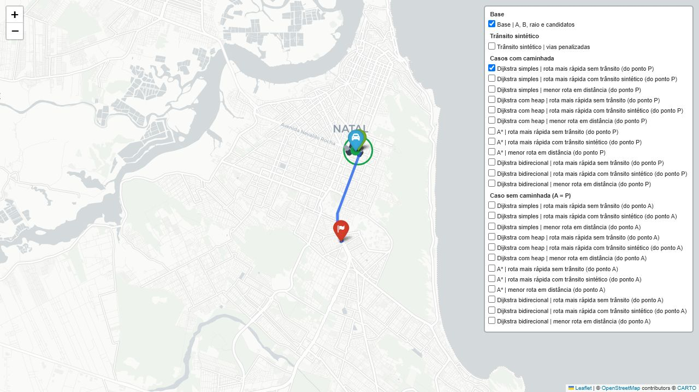
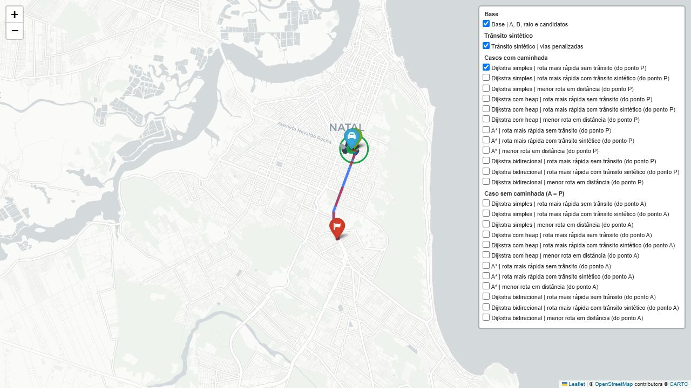
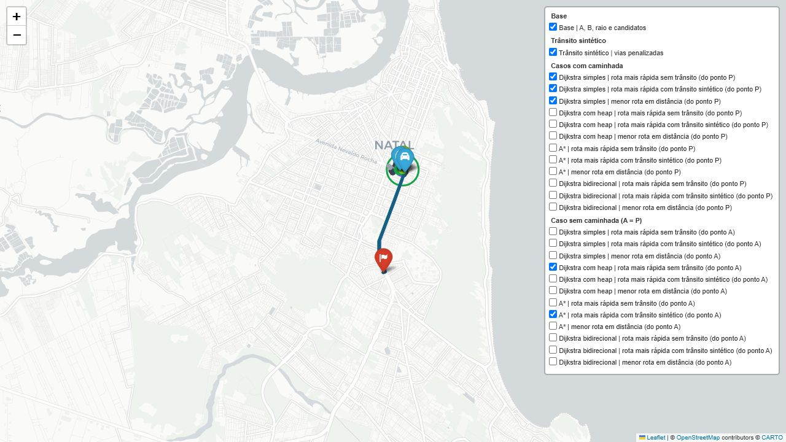
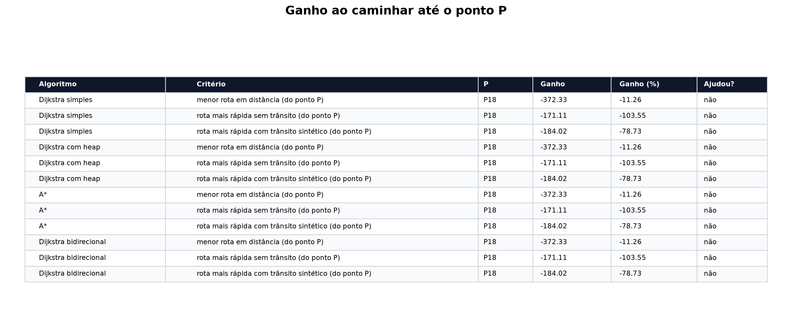

# RideSmart AED2


[Abrir no Google Colab](https://colab.research.google.com/github/edivelton/datastructure/blob/main/projects/ridesmart-aed2/RideSmart_AED2.ipynb)

## Integrantes
- **Edivelton Rafaett Silva de Araújo**
- **Francisco Micarlos Teixeira Pinto**
- **Joanderson Luan da Silva Linhares**

## Visão Geral


O **RideSmart AED2** é um estudo de modelagem em grafos para avaliar se permitir que um passageiro caminhe até um ponto de embarque alternativo pode melhorar uma viagem urbana.

O problema considera:

- **A**: ponto inicial do passageiro;
- **B**: destino final;
- **X**: raio máximo de caminhada;
- **P**: ponto de embarque escolhido dentro do raio de caminhada.

A viagem é modelada em dois trechos:

```text
A -> P: caminhada no grafo de pedestres
P -> B: carro no grafo de direção
```

O notebook compara algoritmos de caminho mínimo, pesos de aresta e cenários com ou sem caminhada. O foco é a análise algorítmica, não a simulação de um motorista antes do embarque.

## Notebook Principal

```text
RideSmart_AED2.ipynb
```

O notebook está estruturado para ser executado localmente ou no Google Colab. Ele baixa os grafos da cidade escolhida com OSMnx, calcula candidatos a ponto de embarque, executa os algoritmos e gera tabelas e mapas interativos.

## Modelagem dos Grafos

O projeto usa duas malhas separadas do OpenStreetMap:

| Grafo | OSMnx | Uso |
|---|---|---|
| Grafo de caminhada | `network_type="walk"` | calcular o deslocamento do passageiro de **A** até **P** |
| Grafo de direção | `network_type="drive"` | calcular o trajeto de carro de **P** até **B** |

Essa separação evita misturar regras de deslocamento. O pedestre pode usar caminhos que o carro não pode usar, enquanto o carro precisa respeitar a malha viária direcionada.

## Entrada dos Pontos

O notebook aceita duas formas de entrada para **A** e **B**.

Por nome/endereço:

```python
PONTO_A = "Midway Mall, Natal, RN, Brasil"
PONTO_B = "Agaé, Natal, RN, Brasil"
```

Por coordenadas:

```python
PONTO_A = (-5.811698, -35.204570)
PONTO_B = (-5.840596, -35.210751)
```

Quando a entrada é textual, o OSMnx faz geocodificação. Quando a entrada é uma tupla/lista, o notebook interpreta como `(latitude, longitude)`.

## Candidatos a Ponto de Embarque

O ponto **P** não é escolhido manualmente. Primeiro, o notebook encontra todos os nós alcançáveis a pé dentro do limite **X**:

```text
D_walk(A, P_i) <= X
```

Depois, cada candidato caminhável é associado à malha de carros usando uma regra em duas etapas:

1. Se o nó de caminhada também existir no grafo de carro, ele é usado diretamente.
2. Se não existir, o notebook procura o nó viário mais próximo.

O candidato só é aceito se a distância extra até o nó de carro for pequena:

```text
distância(P_walk, P_drive) <= DISTANCIA_MAX_EMBARQUE_CARRO_M
```

No notebook atual, esse limite é configurado como:

```python
DISTANCIA_MAX_EMBARQUE_CARRO_M = 25
```

Essa regra preserva uma modelagem limpa quando o nó é compartilhado e, ao mesmo tempo, permite lidar com a diferença real entre as malhas `walk` e `drive` do OSMnx.

## Funções de Custo

Para cada candidato **P_i**, o notebook calcula:

```text
D_walk(A, P_i): distância caminhando
T_walk(A, P_i): tempo caminhando
D_drive(P_i, B): distância de carro
T_drive(P_i, B): tempo de carro
```

Para menor distância:

```text
Custo_D(P_i) = D_walk(A, P_i) + D_drive(P_i, B)
```

Para menor tempo:

```text
Custo_T(P_i) = T_walk(A, P_i) + T_drive(P_i, B)
```

O caso sem caminhada também é calculado:

```text
P = A
```

Assim, o notebook consegue medir o ganho de caminhar:

```text
ganho = custo_sem_caminhada - custo_com_P
```

Interpretação:

- `ganho > 0`: caminhar ajudou;
- `ganho = 0`: caminhar não alterou o resultado;
- `ganho < 0`: caminhar piorou.

## Pesos Avaliados

Cada algoritmo é avaliado em três critérios:

| Critério | Peso usado | Interpretação |
|---|---|---|
| Menor distância | `length` | minimiza metros percorridos |
| Rota mais rápida sem trânsito | `travel_time` | minimiza tempo estimado sem congestionamento |
| Rota mais rápida com trânsito sintético | `traffic_time` | minimiza tempo após penalizações de trânsito |

O trânsito não altera a distância física da rua. Por isso, a menor distância continua usando apenas `length`.

## Trânsito Sintético

O trânsito sintético é construído em duas fases.

Primeiro, todos os algoritmos rodam sem trânsito para encontrar suas rotas rápidas normais:

- com caminhada: **P -> B**;
- sem caminhada: **A -> B**.

Depois, o notebook reúne os trechos dessas rotas e aplica penalização em parte deles:

```text
traffic_time = travel_time * fator_de_trânsito
```

Os fatores usados ficam entre:

```text
2.0 e 4.0
```

Essa escolha torna o cenário mais justo e mais realista:

- o trânsito não é sorteado em qualquer rua da cidade;
- ele aparece em trechos que eram bons em condição normal;
- todos os algoritmos enfrentam o mesmo ambiente congestionado.

## Algoritmos Comparados

| Algoritmo | Papel na comparação |
|---|---|
| Dijkstra simples | baseline sem fila de prioridade |
| Dijkstra com heap | versão otimizada com fila de prioridade |
| A* | busca informada com heurística geográfica |
| Dijkstra bidirecional | busca simultânea da origem e do destino |

Os Dijkstras `single-source` aproveitam uma busca reversa a partir de **B** para avaliar todos os candidatos **P**. Já o A* e o Dijkstra bidirecional são ponto a ponto, então são executados separadamente para cada candidato.

## Mapas e Filtros

O notebook gera dois mapas principais.

### Mapa inicial

Mostra:

- ponto **A**;
- ponto **B**;
- raio máximo de caminhada **X**;
- candidatos **P**;
- candidatos válidos para embarque.

### Mapa consolidado

Mostra todas as soluções em um único mapa interativo, com filtros por grupo.

Grupos principais:

- **Casos com caminhada**;
- **Caso sem caminhada (A = P)**;
- **Trânsito sintético**;
- **Base**.

Para cada algoritmo, aparecem camadas de:

- rota mais rápida sem trânsito;
- rota mais rápida com trânsito sintético;
- menor rota em distância.

A cor vermelha é reservada para as vias penalizadas pelo trânsito sintético. As rotas usam cores diferentes para facilitar comparação visual.

## Visualizações do Exemplo

As imagens abaixo foram geradas a partir de uma execução do notebook em Natal/RN.

### Mapa inicial dos candidatos

Este mapa mostra a origem **A**, o destino **B**, o raio máximo de caminhada **X** e os candidatos **P** encontrados na malha de pedestres.


### Mapa final com filtros

O mapa consolidado reúne os filtros por algoritmo, critério e cenário. A partir dele é possível ligar/desligar rotas para comparar visualmente as soluções.



### Trânsito sintético

As vias em vermelho representam trechos penalizados pelo trânsito sintético. Esses trechos tiveram o peso `traffic_time` aumentado.



### Comparação de rotas

Nesta visualização, várias camadas foram ligadas ao mesmo tempo para demonstrar como o mapa pode ser usado para comparar rotas e cenários.



### Ganho ao caminhar

A tabela resume o ganho obtido ao caminhar até **P** em comparação com o caso sem caminhada.



## Saídas Geradas

Ao executar o notebook, os arquivos são salvos em:

```text
saidas_ridesmart_aed2/
```

Principais saídas:

```text
mapa_inicial_candidatos_ridesmart_aed2.html
mapa_consolidado_ridesmart_aed2.html
resultados_consolidados_ridesmart_aed2.csv
ganho_ao_caminhar_ridesmart_aed2.csv
```

As saídas são geradas durante a execução e não precisam estar versionadas no repositório.

## Validação Automática

O notebook possui uma célula de validação que verifica se:

- as rotas de carro terminam em **B**;
- o caso sem caminhada começa em **A**;
- os casos com caminhada possuem caminho a pé de **A** até **P**;
- os custos calculados são finitos.

Se alguma camada estiver inconsistente, o notebook gera erro antes da entrega passar despercebida.

## Como Executar

### Opção 1: Google Colab

Abra pelo botão:

[Abrir no Google Colab](https://colab.research.google.com/github/edivelton/datastructure/blob/main/projects/ridesmart-aed2/RideSmart_AED2.ipynb)

Depois execute as células em ordem.

### Opção 2: Ambiente local

Instale as dependências:

```bash
pip install osmnx networkx pandas numpy folium matplotlib jupyter
```

Abra o notebook:

```bash
jupyter notebook RideSmart_AED2.ipynb
```

## Estrutura do Projeto

```text
ridesmart-aed2/
|-- README.md
`-- RideSmart_AED2.ipynb
```

## Limitações da Modelagem

O ponto de embarque é representado por nós do grafo viário. Em um sistema real, o embarque poderia ocorrer em um ponto ao longo de uma aresta, como no meio de uma rua. Neste trabalho, a aproximação por nó mantém o problema aderente à modelagem em grafos e aos algoritmos de menor caminho.

O trânsito também é sintético. Ele não representa dados reais em tempo real, mas cria um cenário controlado para avaliar como os algoritmos se comportam quando trechos de rotas rápidas ficam penalizados.

## Tecnologias

- Python;
- OSMnx;
- NetworkX;
- Pandas;
- NumPy;
- Folium;
- Matplotlib;
- Jupyter Notebook.
